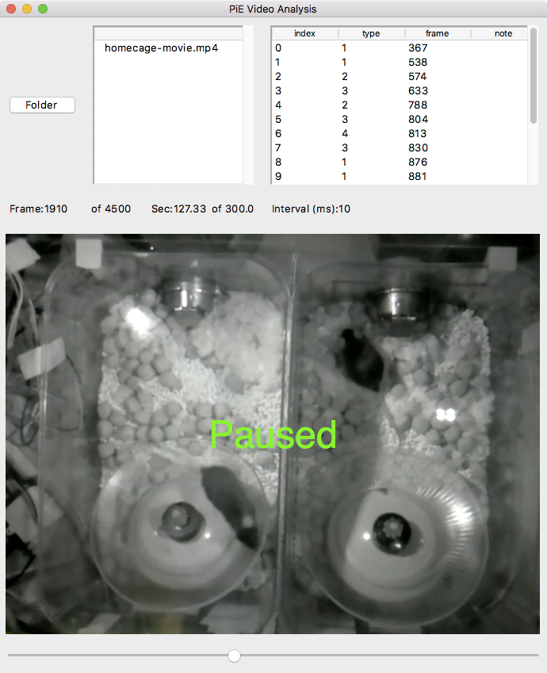

## Video player

This is a Python based video player that allows frames to be annotated.

**Disclaimer**. As of November 2018, this is a work in progress and is updated daily.

## Screenshot

Video files are listed in upper left. Annotations of current video are in upper right. Selecting an annotation from the list will snap the video to the frame of the annotation.



## Keyboard commands

Controlling video

| Keyboard	| Action 
| -----		| -----
| space		| play/pause
| left/right arrows	| Backward/forward in video
| shift + left/right arrows	| Larger backward/forward in video
| +				| Play video faster, sets interval (ms)
| -				| Play video slower, sets interval (ms)

Editing annotations

| Keyboard	| Action 
| -----		| -----
| 1..9			| Create new annotation at current frame
| f				| Set first frame of selected event
| l				| Set last frame of selected event
| n				| Set note of current selected annotation

There are currently 9 different annotation types corresponding to keyboard 1, 2, 3, 4, 5, 6, 7, 8, 9.

## Saving annotations

All annotations are saved in a text file (.txt) with the same base name as the video file. For example

```
#
index,path,cseconds,type,frame,note,
0,/Users/cudmore/Dropbox/PiE/homecage-movie.mp4,1542328413.412974,1,367,,,
1,/Users/cudmore/Dropbox/PiE/homecage-movie.mp4,1542328419.127083,1,538,,,
2,/Users/cudmore/Dropbox/PiE/homecage-movie.mp4,1542328420.329067,2,574,,,
3,/Users/cudmore/Dropbox/PiE/homecage-movie.mp4,1542328422.295312,3,633,,,
4,/Users/cudmore/Dropbox/PiE/homecage-movie.mp4,1542330941.973472,2,788,,,
5,/Users/cudmore/Dropbox/PiE/homecage-movie.mp4,1542330942.505339,3,804,,,
```

## Install on macOS

1)  [Brew](https://brew.sh/)

2) OpenCV (takes a long time to build)
	
	brew install opencv3 --with-python3

3) Pillow

	pip3 install pillow

4) Make sure you have required Python libraries

 - [numpy](http://www.numpy.org/)
 - [tkinter](https://docs.python.org/3/library/tkinter.html)
	
If having trouble with Homebrew and OpenCV, see [this tutorial](https://www.pyimagesearch.com/2016/12/19/install-opencv-3-on-macos-with-homebrew-the-easy-way/).

## Run

	python3 player.py
	
## To Do

 - Highlight most recent annotation in list as video is played.
 - Expand code to open a folder of video files. Right now it is one hard-coded video file.
 - Finish setting annotation notes with keyboard 'n'.
 - Finish sorting annotation columns when clicked.
 - Add standard video control buttons like play/pause/forward/backward/large-forward/large-backward.
 - Implement saving/loading options via JSON file. Include window geometry and mapping of annotation event numbers to names.
 - Write recipe for installation into Python virtual environment.
 - Design system where annotations can have start/stop frames or start frame and number of frames (duration). Right now annotations only have single (start) frame.
 - Add note to video file by putting it in event list header
 
## Learning Tkinter

https://www.inoreader.com/article/3a9c6e79a229d841-stack-abuse-gui-development-with-python-tkinter-an-introduction

https://www.pyimagesearch.com/2016/05/23/opencv-with-tkinter/

https://www.pyimagesearch.com/2016/05/30/displaying-a-video-feed-with-opencv-and-tkinter/

https://www.pyimagesearch.com/2017/02/06/faster-video-file-fps-with-cv2-videocapture-and-opencv/
