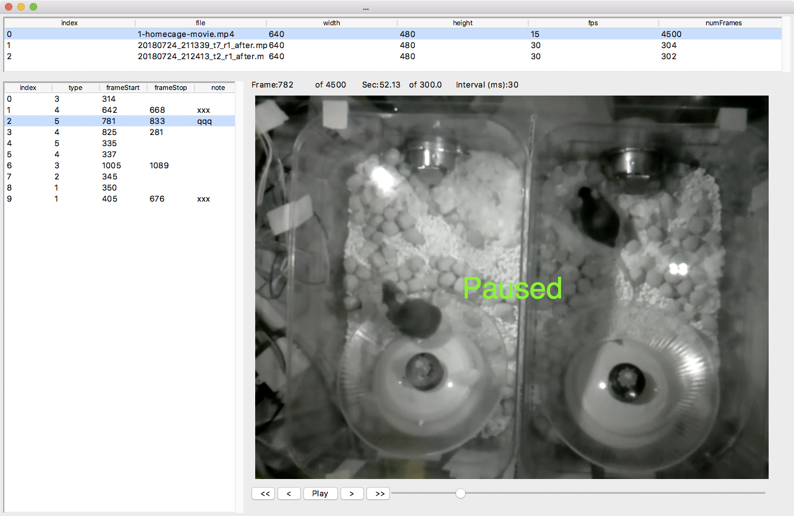
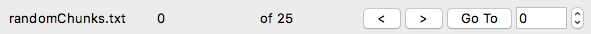

## Video player

A Python based video player that allows videos to be annotated with events.

**Disclaimer**. As of November 2018, this is a work in progress and is updated daily.

## Screenshot

Video files are listed on top, events of current video on the left. Selecting an event from the list will snap the video to the first frame of the event.



## Install on macOS

Clone repository

	cd ~
	git clone https://github.com/cudmore/pie-analysis.git

Install video-player

	cd pie-analysis/video-player
	./install-player

Run

	cd pie-analysis/video-player
	./player

## Keyboard commands

Controlling video

| Keyboard	| Action 
| -----		| -----
| space		| play/pause
| left-arrow	| Move backwards in video
| rigth-arrow	| Move forwards in video
| shift + left arrow	| Larger move backward in video
| shift + right arrow	| Larger move forward in video
| +				| Play video faster
| -				| Play video slower

Editing events

| Keyboard	| Action 
| -----		| -----
| 1..9			| Create new event at current frame
| f				| Set first frame of selected event
| l				| Set last frame of selected event
| n				| Set note of current selected event

There are currently 9 different event types corresponding to keyboard 1, 2, 3, 4, 5, 6, 7, 8, 9.

## Menus

**File**

 - **Open Folder...** - Open a folder of video files. Video files must be mp4.
 - **Open Random Chunks...** - Open a random chunks file. See [Blind scoring](#blind_scoring).
 - **Save Options** - Save options to a file. Options will be reloaded next time program runs. See [Options file](#options_file).
 - **Quit** - Quit the video player. Options are automatically saved before quit.

**Window**

Toggle interface on/off for: video files, events, video feedback, and chunks.
 
## Saving events

All events are automatically saved in a text file (.txt) with the same base name as the video file. One events .txt file per video file. The events file is saved when new events are created or edited (first/last frame, note, file video note).

First line in events file is comma separated list of name=value pairs describing the associated video. Second line is column headers. Remaining lines in file are event with one event per line. For example, an events file with three events would look like this:

```
#
path=/Users/cudmore/Dropbox/PiE/video/1-homecage-movie.mp4,fileName=1-homecage-movie.mp4,width=640.0,height=480.0,aspectRatio=0.75,fps=15.0,numFrames=4500,numSeconds=300.0,numEvents=22,videoFileNote=,
index,path,cSeconds,cDate,cTime,typeNum,typeStr,frameStart,frameStop,numFrames,sStart,sStop,numSeconds,chunkIndex,note,
0,/Users/cudmore/Dropbox/PiE/video/1-homecage-movie.mp4,1543552305.756366,2018-11-29,23:31:45,1,a,2468,,None,164.53,None,None,4,,,
1,/Users/cudmore/Dropbox/PiE/video/1-homecage-movie.mp4,1543552306.0374012,2018-11-29,23:31:46,2,b,2468,,None,164.53,None,None,4,,,
2,/Users/cudmore/Dropbox/PiE/video/1-homecage-movie.mp4,1543552306.435797,2018-11-29,23:31:46,3,c,2473,,None,164.87,None,None,4,,,
3,/Users/cudmore/Dropbox/PiE/video/1-homecage-movie.mp4,1543552306.8971589,2018-11-29,23:31:46,4,d,2479,,None,165.27,None,None,4,,,
```

<a name="blind_scoring"></a>
## Blind Scoring



| Button	| Action 
| -----		| -----
| <		| Go to previous chunk
| \|<		| Go to start of current chunk
| >		| Go to next chunk
| Go To	| Go to chunk number specified in the edit/spin box.
| Limit Video Controls	| Limit the video frame slider and all video controls (including keyboard) to stay within the current chunk. In addition, when checked, the event list will only show events within the current chunk.
| Limit Interface		| Show/hide video file list and video feedback. Turn this on for true blinding.

Blind scoring is done with a user created 'chunks' file. Once created, blinding is achieved by stepping through a number of (random) video chunks of a specified length.

Use the following code to generate a chunks file. Once created, rename it 'randomChunks.txt' and it will automatically be loaded when the video-player is run.

```
	# full path to your video folder
	path = '/Users/cudmore/Dropbox/PiE/video'
	chunks = bChunk(path)
	
	chunkIntervalSeconds = 300 #frames
	chunksPerFile = 5
	chunks.generate(chunkIntervalSeconds, chunksPerFile)
```

Blinding Algorithm

 - **video file duration (30 min)**
 - **pieceDur (10 min)** gives us numPieces = dur / pieceDur
 - **totalNumChunks (30)** is total number of chunks for one video
 - **chunkDur (10 sec)** is duration of each chunk
 1. split video into a large number of chunks numChunks = (dur/chunkDur)
 2. partition video into a number of 'pieces' numPieces = (dur/pieceDur)
 3. chunksPerPiece = totalNumChunks/numPieces
 4. for each 'piece', randomly choose chunksPerPiece without replacement. Can do this by stepping through all chunks and only considering chunks with a piece using chunksPerPiece.
 
 - Add 'pieceIndex' to each chunk in output chunk list
 

<a name="options_file"></a>
## Options file

Interface options can be saved with menu 'File - Save Options'. Options are also saved each time the program is quit with 'File - Quit'.

The options are saved in a json file 'options.json' and can be manually edited. By manually editing the 'options.json' file, mappings between event numbers 1..9 and names can be specified. In addition, the duration the video is advanced/reversed with either the keyboard or video control buttons can be set with 'smallSecondsStep' and 'largeSecondsStep'.

```
{
    "appWindowGeometry": "1035x698",
    "eventTypes": {
        "1": "a",
        "2": "b",
        "3": "c",
        "4": "d",
        "5": "e",
        "6": "f",
        "7": "g",
        "8": "h",
        "9": "i"
    },
    "fpsIncrement": 5,
    "smallSecondsStep": 10,
    "largeSecondsStep": 60,
    "showVideoFiles": true,
    "showEvents": true,
    "showRandomChunks": true,
    "showVideoFeedback": true,
    "videoFileSash": 200,
    "eventSash": 400,
    "lastPath": "/Users/cudmore/Dropbox/PiE/video"
}
```

## Troubleshooting

### Intermediate Install

Requires Python 3.7, Open CV 3, Pillow (PIL), Numpy

```
git clone https://github.com/cudmore/pie-analysis.git
cd pie-analysis/video-player
mkdir player_env
virtualenv -p python3 --no-site-packages player_env
source player_env/bin/activate
pip install -r requirements.txt
```

### Advanced Install

	# install homebrew
	ruby -e "$(curl -fsSL https://raw.githubusercontent.com/Homebrew/install/master/install)"

	# upgrade to Python 3.7
	brew upgrade python
	
	# check Python 3.7 is installed, should return Python 3.7.1
	python3 --version
	
	# check pip3, should return
	# pip 18.1 from /usr/local/lib/python3.7/site-packages/pip (python 3.7)
	pip3 --version
	
	# add the following to profile using 'pico ~/.profile'
	# assuming username is 'cudmore', change as neccessary
	export PATH="$PATH:/Users/cudmore/Library/Python/3.7/bin"

	# activate the changes made to path
	source ~/.profile
	
	# clone repository
	git clone https://github.com/cudmore/pie-analysis.git
	
	# create a python 3 virtual environment 'player_env' and activate it
	# once activated, command line should begin with '(env)'
	cd pie-analysis/video-player
	mkdir player_env
	virtualenv -p python3 --no-site-packages player_env
	source player_env/bin/activate
	
    # install with pip
    pip install -r requirements.txt

	# if needed, install opencv with brew
	brew install opencv3 --with-python3
    
Current working system has 'pip freeze'

```
numpy==1.15.4
opencv-python==3.4.3.18
Pillow==5.3.0
```

	
## Known bugs

 - [fixed] Has some problems when it reaches end of file.
 - [fixed] Resizing window will sometimes cause a crash.
 
## To Do

 - Implement 2nd layer of random chunks with 'pieces'.
 - Stop saving/loading event 'index'. Switch event list view to use internal tkinter treeview index.
 - Implement 'delete event'.
 - Recalculate chunkIndex when setting event startFrame with keyboard 'f'.
 - Make fps a spin box to easily increase/descrease.
 - Highlight most recent event in list as video is played. Need to sort by startFrame.
 - Finish sorting event columns when clicked. Need to insert str(), int(), float() to do this.
 - Just always sort events by frameStart.
 - Add note to video file by putting it in event list header. Finish 'right-click' popup menu in video list.
 - Add option to warn when event frame start/stop is out of order, e.g. frameStart>frameStop.
 - [bug] Make sure toggle of video file and event list do not trash interface on next run. Need to add code to HIDE video and event list, currently setting sashpos==0 (remove this).
 - [bug] When increasing/decreasing fps with +/-, sometimes can not get back to orignal fps. Fix this. This is now fixed but minimum fps is no longer 1 fps.
 - [big idea] Make a visual bar for each video file showing: duration (black) overlaid .with position of chunks (gray), and position of events (bright colors). 
 
## To Do (done)

 - [hopefully done, bug] Make sure chunk navigation is working: >, <, go to.
 - [hopefully done, bug] frame slider gets corrupted and does not move during chunk editing
 - [hopefully done, bug] Make sure video controls (buttons and keyboard) stay within chunk when 'Limit Controls' is on.
 - [done] Need some way to 1) categorize/file each event into its chunk 2) detect events falling outside a chunk.
 - [done] During chunk editing, hijack ALL video controls (frame slider, play, >, >>, <, <<) to only allow scrolling through frames in current chunk.
 - [done] Add checkbox to activate/inactivate chunk editing.
 - [done] Running video faster/slower using +/- increments frame interval, it should increment frames per second (+/- 5 fps). Maximum fps for tkinter seems to be ~90 fps. 
 - [done] Implement saving/loading options via JSON file. Include window geometry, show/hide, (MAYBE) mapping of event numbers to names.
 - [done] Toggle 'play' button to reflect state e.g. play and pause.
 - [done] Add option to hide video controls like we hide video file list and event list.
 - [done] Add information about video file to saved event list .txt file, e.g. (path=xxx, numframes=yyy, fps=zzz).
 - [done] Expand code to open a folder of video files. Right now it is one hard-coded video file.
 - [done] Add standard video control buttons like play/pause/forward/backward/large-forward/large-backward.
 - [done] Finish setting event notes with keyboard 'n'.
 - [done] Write recipe for installation into Python virtual environment.
 - [done] Design system where events can have start/stop frames or start frame and number of frames (duration). Right now events only have single (start) frame.

