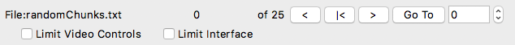

## Video player

A Python based video player that allows videos to be annotated with events.

**Disclaimer**. As of November 2018, this is a work in progress and is updated daily.

## Screenshot

Video files are listed on top, events of current video on the left. Selecting an event from the list will snap the video to the first frame of the event.


Example screenshot of editing a video 'chunk'. All events within the chunk are shown schematically below the video. The number in the event is the event type (1..9). Selecting an event will snap the video to the first frame of the event. In this case, the 4th event is selected. Once selected the event start/stop frame can be edited with keyboard 'f' and 'l'.


## Install on macOS

**Coming Soon**. We will provide a stand-alone macOS app that does not require any special installation, just download and run.

To manually install from source, see [Install](#install) section below.

## Keyboard commands

Controlling video

| Keyboard	| Action 
| -----		| -----
| space		| play/pause
| left-arrow	| Move backwards in video
| rigth-arrow	| Move forwards in video
| shift + left arrow	| Larger move backward in video
| shift + right arrow	| Larger move forward in video
| +				| Play video faster
| -				| Play video slower

Editing events

| Keyboard	| Action 
| -----		| -----
| 1..9			| Create new event at current frame
| f				| Set first frame of selected event
| l				| Set last frame of selected event
| n				| Set note of current selected event

Chunks

| Keyboard	| Action 
| -----		| -----
| [			| Previous Chunk
| ]			| Next Chunk

There are currently 9 event types corresponding to keyboard 1, 2, 3, 4, 5, 6, 7, 8, 9.

## Menus

**File**

 - **Open Folder...** - Open a folder of video files. Video files must be mp4.
 - **Open Random Chunks...** - Open a random chunks file. See [Blind scoring](#blind_scoring).
 - **Save Options** - Save options to a file. Options will be reloaded next time program runs. See [Options file](#options_file).
 - **Quit** - Quit the video player. Options are automatically saved before quit.

**Window**

Toggle interface on/off for: video files, events, video feedback, and chunks.
 
## Saving events

All events are automatically saved in a text file (.txt) with the same base name as the video file. One events .txt file per video file. The events file is saved when new events are created or edited (first/last frame, note, file video note).

First line in events file is comma separated list of name=value pairs describing the associated video. Second line is column headers. Remaining lines in file are event with one event per line. For example, an events file with three events would look like this:

```
#
path=/Users/cudmore/Dropbox/PiE/video/1-homecage-movie.mp4,fileName=1-homecage-movie.mp4,width=640.0,height=480.0,aspectRatio=0.75,fps=15.0,numFrames=4500,numSeconds=300.0,numEvents=22,videoFileNote=,
index,path,cSeconds,cDate,cTime,typeNum,typeStr,frameStart,frameStop,numFrames,sStart,sStop,numSeconds,chunkIndex,note,
0,/Users/cudmore/Dropbox/PiE/video/1-homecage-movie.mp4,1543552305.756366,2018-11-29,23:31:45,1,a,2468,,None,164.53,None,None,4,,,
1,/Users/cudmore/Dropbox/PiE/video/1-homecage-movie.mp4,1543552306.0374012,2018-11-29,23:31:46,2,b,2468,,None,164.53,None,None,4,,,
2,/Users/cudmore/Dropbox/PiE/video/1-homecage-movie.mp4,1543552306.435797,2018-11-29,23:31:46,3,c,2473,,None,164.87,None,None,4,,,
3,/Users/cudmore/Dropbox/PiE/video/1-homecage-movie.mp4,1543552306.8971589,2018-11-29,23:31:46,4,d,2479,,None,165.27,None,None,4,,,
```

## Analysis

### Event Analysis

 - See [Analysis/eventAnalysis](https://github.com/cudmore/pie-analysis/blob/master/video-player/analysis/eventAnalysis.ipynb).
 - For each file, sum duration (sec) of each event type (1..9)
 - flag events that have start/stop frame out of order
 - flag events that overlap with previous event (if previous has duration)
 - flag events outside of a chunk

### Blinding analysis

 - Make plot of chunks with each file in a list of files. See [Analysis/chunkAnalysis](https://github.com/cudmore/pie-analysis/blob/master/video-player/analysis/chunkAnalysis.ipynb).


<a name="blind_scoring"></a>
## Blind Scoring



| Button	| Action 
| -----		| -----
| <		| Go to previous chunk (keyboard '[')
| \|<		| Go to start of current chunk
| >		| Go to next chunk (keyboard ']')
| Go To	| Go to chunk number specified in the edit/spin box.
| Limit Video Controls	| Limit the video frame slider and all video controls (including keyboard) to stay within the current chunk. In addition, when checked, the event list will only show events within the current chunk.

Blind scoring is done with a user created 'chunks' file. Once created, blinding is achieved by stepping through a number of (random) video chunks of a specified length.

Use the following code to generate a chunks file for a folder of video files. Once created, rename the output file to 'randomChunks.txt' and it will automatically be loaded when the folder of video is loaded into the video-player.

```
	# full path to your video folder
	path = '/Users/cudmore/Dropbox/PiE/video'
	
	chunks = bChunk(path)
	
	pieceDurationSeconds = 10 * 60 # seconds
	chunkDurationSeconds = 10 # seconds
	chunksPerFile = 30
	outFile = chunks.generate(pieceDurationSeconds, chunkDurationSeconds, chunksPerFile)
```

Blinding Algorithm

 - **video file duration (30 min)** 
 - **pieceDur (10 min)** gives us numPieces = dur / pieceDur
 - **totalNumChunks (30)** is total number of chunks for one video
 - **chunkDur (10 sec)** is duration of each chunk
 1. split video into a large number of chunks numChunks = (dur/chunkDur)
 2. partition video into a number of 'pieces' numPieces = (dur/pieceDur)
 3. chunksPerPiece = totalNumChunks/numPieces
 4. for each 'piece', randomly choose chunksPerPiece without replacement. Can do this by stepping through all chunks and only considering chunks with a piece using chunksPerPiece.
  
Here is an example of the results of the blinding algorithm for 6 video files, 30 chunks each. Each colored symbol is a different random chunk (duration 10 sec) and the color scale shows the order the chunks are visited. There are 180 chunks spread across the 6 files.
 
 

Blinding file format

 - params: dict of parameters used to generate random chunks
  - chunkDurationSeconds:
  - chunksPerFile:
  - pieceDurationSeconds:
  - generated:
 - chunkOrder: integer list of random chunk order
 - chunks: dict list of chunks

chunks

```
        {
            "index": 0,
            "numFrames": 299,
            "path": "/Users/cudmore/Dropbox/PiE/scrambled/s_1831.mp4",
            "piece": 0,
            "randomIndex": 55,
            "startFrame": 5083,
            "stopFrame": 5381
        },
        {
            "index": 1,
            "numFrames": 299,
            "path": "/Users/cudmore/Dropbox/PiE/scrambled/s_1831.mp4",
            "piece": 0,
            "randomIndex": 29,
            "startFrame": 11362,
            "stopFrame": 11660
        },
        {
            "index": 2,
            "numFrames": 299,
            "path": "/Users/cudmore/Dropbox/PiE/scrambled/s_1831.mp4",
            "piece": 0,
            "randomIndex": 16,
            "startFrame": 13156,
            "stopFrame": 13454
        },
```

<a name="options_file"></a>
## Options file

Interface options can be saved with menu 'File - Save Options'. Options are also saved each time the program is quit with 'File - Quit'.

The options are saved in a json file 'options.json' and can be manually edited. By manually editing the 'options.json' file, mappings between event numbers 1..9 and names can be specified. In addition, the duration the video is advanced/reversed with either the keyboard or video control buttons can be set with 'smallSecondsStep' and 'largeSecondsStep'.

```
{
    "appWindowGeometry": "1035x698",
    "eventTypes": {
        "1": "a",
        "2": "b",
        "3": "c",
        "4": "d",
        "5": "e",
        "6": "f",
        "7": "g",
        "8": "h",
        "9": "i"
    },
    "fpsIncrement": 5,
    "smallSecondsStep": 10,
    "largeSecondsStep": 60,
    "showVideoFiles": true,
    "showEvents": true,
    "showRandomChunks": true,
    "showVideoFeedback": true,
    "videoFileSash": 200,
    "eventSash": 400,
    "lastPath": "/Users/cudmore/Dropbox/PiE/video"
}
```


	
## Known bugs

 - [fixed] Has some problems when it reaches end of file.
 - [fixed] Resizing window will sometimes cause a crash.
 - Check that avconv (used by PiE server on Pi) always generates valid mp4 files. See [here](https://trac.ffmpeg.org/ticket/7365). In at least one file, getting errors like 'Invalid NAL unit size' and 'Error splitting the input into NAL'. Maybe save original .h264 on Pi so we can convert later if neccessary.

## To Do (important)

 - [done] Implement single menu to turn blinding on/off
 - [bug] turning blinding on, the video stream is not paused???
 - scrolling up/down with arrow keys through video file list is NOT updating to next video. Clicking in list DOES work.
 - When starting app and chunk file is loaded, make sure we are in chunk 0. When user first clicks 'limit', we need to be in a chunk!!!
 - Clicking on a chunk (gray bar) should select chunk (in chunk view).
 - Selecting event in event list should highlight event in event canvas.
 - Streamline interface for blinding. Make a system where when handed to a scorer, they can not activate non-blinded interface (they are locked into blinding). Try and add a password to switch between one and the other.
 - Update numEvents in video list as we add/delete events
 - Make menu interface to create random chunks file from folder. So we can do it in stand-alone app
 - Add dIndex to events so we can always show events in list with 'index' column as 1,2,3,...
 - When editing chunks, do not allow video list selection
 - Recalculate chunkIndex when setting event startFrame with keyboard 'f'.
 - [hard] switch event list interface when editing chunks. Show frame start/stop relative to start of current chunk
 
## To Do

 - [done?] Fix chunk interface, it is remembering pointers to old chunk file
 - Implement options dialog to set small/big keyboard steps (Seconds) 
 - Finish 'about dialog'
 - Make fps a spin box to easily increase/descrease.
 - [solved] Highlight most recent event in list as video is played. Need to sort by startFrame.
 - [solved] Add option to warn when event frame start/stop is out of order, e.g. frameStart>frameStop.
 - Add note to video file by putting it in event list header. Finish 'right-click' popup menu in video list.
 - [bug] Make sure toggle of video file and event list do not trash interface on next run. Need to add code to HIDE video and event list, currently setting sashpos==0 (remove this).
 - [bug] When increasing/decreasing fps with +/-, sometimes can not get back to orignal fps. Fix this. This is now fixed but minimum fps is no longer 1 fps.
 - [big idea - done] Make a visual bar for each video file showing: duration (black) overlaid .with position of chunks (gray), and position of events (bright colors). 
 
## To Do (done)

 - [done] In event tree, select and go to next event when event is deleted (if next event exists)
 - [done] Add option to turn off delete event warning
 - [done] Implement second layer of blinding with 'parts' to evenly distribute random chunks through file
 - [done] Finish sorting event columns when clicked. Need to insert str(), int(), float() to do this.
 - [done] Just always sort events by frameStart.
 - [done] Implement 'delete event'. Add dialog to ask if ok.
 - [done] Sort events after setting first frame
 - [done] Add differnet small/big step for chunk edit
 - [done] Standardize chunk index. I am showing random index in chunk interface but absolute chunk index in event list.
 - Now building standalone app with pyinstaller
 - Added video edit icon
 - [hopefully done, bug] Make sure chunk navigation is working: >, <, go to.
 - [hopefully done, bug] frame slider gets corrupted and does not move during chunk editing
 - [hopefully done, bug] Make sure video controls (buttons and keyboard) stay within chunk when 'Limit Controls' is on.
 - [done] Need some way to 1) categorize/file each event into its chunk 2) detect events falling outside a chunk.
 - [done] During chunk editing, hijack ALL video controls (frame slider, play, >, >>, <, <<) to only allow scrolling through frames in current chunk.
 - [done] Add checkbox to activate/inactivate chunk editing.
 - [done] Running video faster/slower using +/- increments frame interval, it should increment frames per second (+/- 5 fps). Maximum fps for tkinter seems to be ~90 fps. 
 - [done] Implement saving/loading options via JSON file. Include window geometry, show/hide, (MAYBE) mapping of event numbers to names.
 - [done] Toggle 'play' button to reflect state e.g. play and pause.
 - [done] Add option to hide video controls like we hide video file list and event list.
 - [done] Add information about video file to saved event list .txt file, e.g. (path=xxx, numframes=yyy, fps=zzz).
 - [done] Expand code to open a folder of video files. Right now it is one hard-coded video file.
 - [done] Add standard video control buttons like play/pause/forward/backward/large-forward/large-backward.
 - [done] Finish setting event notes with keyboard 'n'.
 - [done] Write recipe for installation into Python virtual environment.
 - [done] Design system where events can have start/stop frames or start frame and number of frames (duration). Right now events only have single (start) frame.

## Troubleshooting

### Standalone app

 - Right-click the .app and select 'Show Package Contents'
 - Run the app directly by double-clicking 'Contents - macOS - VideoAnnotate'.
 
This will run the app with a text console showing feedback on the state of the program. If there are errors, they will appear in the text console.

### Running from source

If there are errors when running, check the versions. The video-player requires:

 - Python 3.7 (includes tkinter 8.x)
 - numpy
 - opencv 3
 - Pillow

Check Python version with 'python --version'.

Check Python libraries with 'pip3 freeze'.

```
numpy==1.15.4
Pillow==5.3.0
```

If having problems with opencv, try both installing into Python 'pip3 install opencv-python' and/or installing with brew with 'brew install opencv3 --with-python3'.

The opencv version should be 'opencv-python==3.4.3.18' or newer.

<a name="install"></a>
## Install

### Install - Using 'install-player' script

This install recipe assumes you have Python 3.7, pip, virtualenv, homebrew, and git installed on your computer. If you do not have these things or have no idea what we are talking about, then please see the [Install - Step By Step](#step_by_step_install) section below.

 1. Clone repository

```
cd ~
git clone https://github.com/cudmore/pie-analysis.git
```

 2. Install video-player

```
cd pie-analysis/video-player
./install-player
```

 3. Run

```
cd pie-analysis/video-player
./player
```

### Install - Using requirements file

Requires Python 3.7, Open CV 3, Pillow (PIL), Numpy

```
git clone https://github.com/cudmore/pie-analysis.git
cd pie-analysis/video-player
mkdir player_env
virtualenv -p python3 --no-site-packages player_env
source player_env/bin/activate
pip install -r requirements.txt

# run the player
cd src
python3 VideoApp.py
```

<a name="step_by_step_install"></a>
### Install - Step By Step

You will install the following

 - [Homebrew](https://brew.sh/)
 - [Python 3.7](https://www.python.org/)
 - [Virtualenv](https://virtualenv.pypa.io/en/latest/)
 - [Git](https://git-scm.com/)

```
# Install homebrew
ruby -e "$(curl -fsSL https://raw.githubusercontent.com/Homebrew/install/master/install)"

# Install Python 3.7
brew install python
	
# Upgrade to Python 3.7
brew upgrade python
	
# Check Python 3.7 is installed, should return 'Python 3.7.1' or 'Python 3.7.2'
python3 --version

# install virtualenv if necessary
pip3 install virtualenv

# Install git if necessary
brew install git
```
	
Clone the repository

```
git clone https://github.com/cudmore/pie-analysis.git
```

Run the provided installer

```
cd pie-analysis/video-play
./install-player
```

You should now be able to run the video-player with

```
./player
```

If that does not work, create your own virtual environment and run from there.

```
# Create a Python 3 virtual environment in 'player_env'.
cd ~/pie-analysis/video-player
mkdir player_env
virtualenv -p python3 --no-site-packages player_env

# activate the virtual environment
# Once activated, command line should begin with '(player_env)'
source player_env/bin/activate
	
# install with pip
pip install -r requirements.txt

# finally, run the player with
python3 src/player.py
```

### Deeper troubleshooting

If needed, install opencv with brew

```
brew install opencv3 --with-python3
```
    
